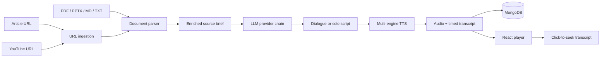
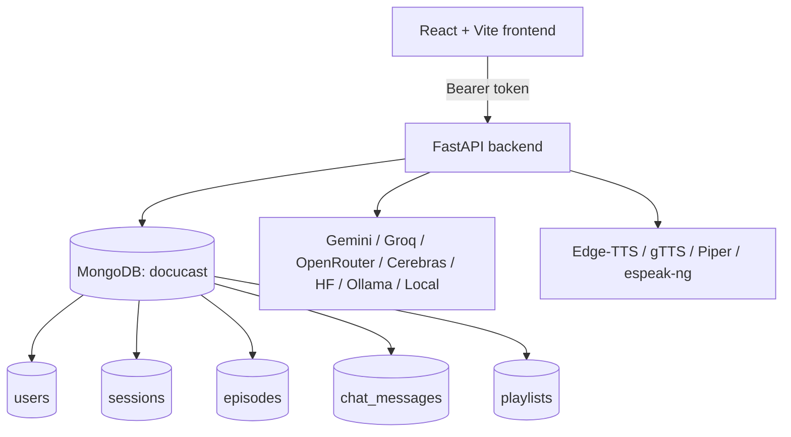

# DocuCast

### Turn documents, links, and video transcripts into listenable conversations.

DocuCast is a full-stack document-to-podcast workspace. Upload a PDF, PPTX, Markdown, or text file, paste an article or YouTube URL, or queue a series of sources. DocuCast extracts the useful content, generates a two-host or solo script, synthesizes audio, and gives you an interactive transcript you can follow while listening.

<p align="center">
  <strong>Ingest</strong> &nbsp; -> &nbsp; <strong>Understand</strong> &nbsp; -> &nbsp; <strong>Script</strong> &nbsp; -> &nbsp; <strong>Listen</strong>
</p>


> DocuCast is designed to work with free providers and local fallbacks. Add an API key for higher-quality cloud generation, or use the built-in local provider and offline TTS engines.

## Contents

- [What it does](#what-it-does)
- [Visual overview](#visual-overview)
- [Features](#features)
- [Project structure](#project-structure)
- [Run locally](#run-locally)
- [Configuration](#configuration)
- [How generation works](#how-generation-works)
- [API](#api)
- [Verification](#verification)
- [Deployment](#deployment)
- [Troubleshooting](#troubleshooting)

## What it does

DocuCast turns source material into a podcast-style episode:

| Input | Result |
| --- | --- |
| PDF, PPTX, Markdown, or TXT | Enriched source brief, script, audio, transcript |
| Article URL | Cleaned article text and podcast episode |
| YouTube URL | Video metadata, available captions, and podcast episode |
| Multiple files or URLs | MongoDB-backed playlist with sequential playback |

The generated episode can include document intelligence such as PDF tables, PPTX charts, images, OCR, handwritten-note hints, and speaker notes when the relevant optional tools are available.

## Visual overview





## Features

### Source intelligence

- PDF text, tables, captions, and embedded images
- PPTX text, native chart data, images, and speaker notes
- Markdown and plain-text files
- Article extraction with headings, paragraphs, quotes, and tables
- YouTube metadata, chapters, descriptions, and available captions
- Optional OCR and vision analysis with graceful fallback behavior

### Podcast generation

- Two-host dialogue or solo narration
- Brief, standard, or deep episode length
- Multiple tones and audience settings
- Free-text focus instructions
- Free-provider fallback chain ending in an offline local summarizer
- TTS fallback chain so audio generation can continue when a cloud service is unavailable

### Listening experience

- Audio playback with seek, skip, speed, and download controls
- Transcript turns synchronized with audio time
- Click a transcript turn to seek directly to it
- Active-turn highlighting and automatic transcript scrolling
- Keyboard-friendly playback controls

### Series and history

- User registration, login, bearer sessions, and logout
- Episode history stored in MongoDB
- Persistent chat messages for episodes
- Batch generation from multiple files and URLs
- Playlists with episode counts and continuous playback

## Project structure

```text
docucast-mvp/
├── backend/
│   ├── main.py                  # FastAPI app and HTTP endpoints
│   ├── requirements.txt         # Python dependencies
│   ├── .env                     # Local secrets and provider settings
│   ├── utils/
│   │   ├── auth.py              # MongoDB users, sessions, episodes, playlists
│   │   ├── document_parser.py   # PDF, PPTX, Markdown, TXT extraction
│   │   ├── url_ingestion.py     # Article and YouTube ingestion
│   │   ├── script_generator.py  # LLM providers and local fallback
│   │   ├── tts_engine.py        # Audio engines and transcript timing
│   │   └── vision.py            # OCR and optional image understanding
│   └── voices/                  # Optional Piper .onnx voices
├── frontend/
│   ├── src/
│   │   ├── App.jsx
│   │   ├── index.css
│   │   └── components/
│   │       ├── UploadSection.jsx
│   │       ├── ResultSection.jsx
│   │       ├── PlaylistSection.jsx
│   │       └── ChatPanel.jsx
│   ├── package.json
│   └── vite.config.js
├── implementation_plan.md
└── README.md
```

## Run locally

### Prerequisites

- Python 3.11 recommended
- Node.js 18 or newer
- MongoDB running at `mongodb://localhost:27017`
- Windows PowerShell, macOS, or Linux shell

### 1. Configure the backend

From the repository root:

```powershell
cd backend
python -m venv .venv
.\.venv\Scripts\Activate.ps1
python -m pip install -r requirements.txt
```

On macOS or Linux:

```bash
cd backend
python3 -m venv .venv
source .venv/bin/activate
python -m pip install -r requirements.txt
```

Create `backend/.env` using the settings below. Keep real API keys out of Git and out of screenshots.

### 2. Start the API

Run this from the `backend` directory so `main:app` resolves correctly:

```powershell
.\.venv\Scripts\python.exe -m uvicorn main:app --reload --port 8000
```

The API is available at [http://localhost:8000](http://localhost:8000). FastAPI docs are available at [http://localhost:8000/docs](http://localhost:8000/docs).

If you launch from the repository root instead:

```powershell
backend\.venv\Scripts\python.exe -m uvicorn --app-dir backend main:app --reload --port 8000
```

### 3. Start the frontend

Open a second terminal:

```powershell
cd frontend
npm install
npm run dev
```

Open the URL printed by Vite, normally [http://localhost:5173](http://localhost:5173).

### 4. Use the app

1. Sign in with the configured account, or register a new account.
2. Choose **Single Document**, **Link / YouTube**, or **Batch Series / Playlist**.
3. Add a source and choose the episode direction.
4. Generate the episode.
5. Play the audio or click a transcript turn to jump to that moment.

## Configuration

The minimum local configuration is:

```dotenv
# Provider mode: auto, gemini, groq, openrouter, cerebras, huggingface, ollama, or local
LLM_PROVIDER=local

# Optional cloud providers
GROQ_API_KEY=...
OPENROUTER_API_KEY=...
GEMINI_API_KEY=...
CEREBRAS_API_KEY=...
HF_TOKEN=...

# Optional local Ollama provider
OLLAMA_HOST=http://localhost:11434

# Authentication defaults for local development
DOCUCAST_USERNAME=admin
DOCUCAST_PASSWORD=docucast
DOCUCAST_AUTH_SECRET=change-me-for-deployment
DOCUCAST_TOKEN_TTL_SECONDS=43200

# MongoDB
MONGODB_URI=mongodb://localhost:27017
MONGODB_DB_NAME=docucast
```

### Provider choices

| Mode | Best for | Internet required | API key |
| --- | --- | ---: | ---: |
| `local` | Reliable offline development | No | No |
| `auto` | Best available configured provider | Usually | Optional |
| `groq` | Fast cloud generation | Yes | Yes |
| `openrouter` | Model choice and free models | Yes | Yes |
| `ollama` | Private local generation | No | No |
| `gemini` | Gemini generation | Yes | Yes |

When `LLM_PROVIDER=auto`, DocuCast tries configured providers and falls back to the built-in local summarizer. For a predictable offline setup, use `LLM_PROVIDER=local`.

### TTS fallback order

```text
Edge-TTS -> gTTS -> Piper -> espeak-ng
```

Piper voices can be placed in `backend/voices/`. Offline engines do not require an API key.

## How generation works

1. The API validates the upload or URL.
2. The parser extracts text and available visual metadata.
3. The source is condensed into an enriched brief.
4. The selected LLM provider creates a dialogue or solo script.
5. TTS renders the script and measures each segment.
6. MongoDB stores the episode, source metadata, audio, and transcript timeline.
7. The frontend renders the player, transcript, notes, and extraction details.

The transcript returned by the TTS layer uses this shape:

```json
[
  {
    "speaker": "NOVA",
    "text": "Welcome to DocuCast.",
    "start": 0.0,
    "end": 2.45
  },
  {
    "speaker": "RHYS",
    "text": "Let us unpack the document.",
    "start": 2.45,
    "end": 5.10
  }
]
```

## API

| Method | Endpoint | Purpose |
| --- | --- | --- |
| `GET` | `/` | Health check and provider status |
| `GET` | `/providers` | Provider availability and setup information |
| `POST` | `/auth/register` | Create a user and session |
| `POST` | `/auth/login` | Sign in and receive a bearer token |
| `POST` | `/auth/logout` | Revoke the current session |
| `GET` | `/auth/me` | Validate the current session |
| `POST` | `/ingest-preview` | Preview a URL before generation |
| `POST` | `/generate` | Generate one episode from a file or URL |
| `POST` | `/batch-generate` | Queue multiple sources as a playlist |
| `GET` | `/episodes` | List the current user's episodes |
| `GET` | `/episodes/{id}` | Retrieve an episode and transcript |
| `GET` | `/playlists` | List the current user's playlists |
| `GET` | `/playlists/{id}` | Retrieve a playlist and its episodes |
| `DELETE` | `/playlists/{id}` | Delete a playlist |

Protected endpoints require:

```http
Authorization: Bearer <session-token>
```

## MongoDB collections

DocuCast uses the `docucast` database and creates these collections:

```text
docucast
├── users          # accounts and password hashes
├── sessions       # hashed bearer tokens with TTL cleanup
├── episodes       # scripts, audio, source metadata, transcripts
├── chat_messages  # episode conversations
└── playlists      # ordered episode groups
```

Connect with MongoDB Compass using `mongodb://localhost:27017` to inspect the data.

## Verification

### Import and database check

From the repository root:

```powershell
backend\.venv\Scripts\python.exe -c "import sys; sys.path.insert(0, '.'); from backend.utils.auth import initialize_database; initialize_database(); print('MongoDB initialization OK')"
```

### Session check

```powershell
backend\.venv\Scripts\python.exe -c "import sys; sys.path.insert(0, '.'); from backend.utils.auth import initialize_database, ensure_user, create_session; initialize_database(); ensure_user('admin', 'docucast'); token = create_session('admin', 3600); print('Session creation OK:', bool(token))"
```

### Frontend build

```powershell
cd frontend
npm run build
```

### Manual smoke test

- Open the frontend and sign in.
- Preview an article URL.
- Generate one episode from a document or URL.
- Click two transcript turns while audio is playing.
- Create a playlist from two sources and test automatic next-track playback.

## Deployment

### Backend

Use a managed MongoDB connection string and set all secrets in the hosting provider's environment configuration. A typical start command is:

```bash
uvicorn main:app --host 0.0.0.0 --port $PORT
```

The deployment must provide:

- `MONGODB_URI`
- `MONGODB_DB_NAME`
- `DOCUCAST_AUTH_SECRET`
- Any selected LLM provider keys

### Frontend

Build from `frontend/`:

```bash
npm run build
```

Set `VITE_API_URL` to the deployed backend URL. Configure the backend CORS origin with the deployed frontend URL when required.

## Troubleshooting

### `ModuleNotFoundError: No module named 'backend'`

Use `main:app` from `backend`, or use `--app-dir backend` from the repository root:

```powershell
cd backend
.\.venv\Scripts\python.exe -m uvicorn main:app --reload
```

### `ModuleNotFoundError: No module named 'bson'`

Uvicorn is using a global Python installation. Use the project interpreter:

```powershell
backend\.venv\Scripts\python.exe -m uvicorn --app-dir backend main:app --reload
```

### `WinError 10013`

Port 8000 is already in use. Find the listener and either stop it or choose another port:

```powershell
Get-NetTCPConnection -LocalPort 8000 -State Listen
backend\.venv\Scripts\python.exe -m uvicorn --app-dir backend main:app --reload --port 8001
```

### Login returns a MongoDB duplicate-key error

Restart the backend after pulling the latest code. Startup removes legacy `email_1` and `token_1` indexes left by older schemas before creating the current indexes.

## License

Add the project's license here before publishing a public distribution.
